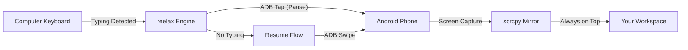

<div align="center">

# 🌊 reelax

**The Ambient Flow-State Scroller**

*Stop staring at your phone. Put it on your desk and let it flow while you code.*

[](https://www.python.org)
[](https://opensource.org/licenses/MIT)
[]()
[]()

---

<p align="center">
  
</p>

`reelax` transforms your Android device into a smart, ambient background display. It auto-scrolls through Instagram Reels, intelligently pausing the moment you touch your keyboard and resuming when you're back in the zone.

[Features](#-features) • [Quick Start](#-quick-start) • [Customization](#-customization) • [Contributing](#-contributing)

</div>

## 💎 Features

| Feature | Description |
| :--- | :--- |
| **🧠 Smart Pause** | Monitors your keyboard locally. Typing = Pause. Idle = Flow. |
| **⚡ Ad-Vanish** | Blazing fast detection that skips "Sponsored" content in ~100ms. |
| **🚫 AI Keyword Block** | Automatically skips reels containing words like `politics` or `crypto`. |
| **📺 Mirroring** | Pinned, always-on-top window using `scrcpy` with audio support. |
| **🎮 Macro Control** | Like (`l`), Save (`s`), Volume (`+/-`), and Skip (`n`) right from your terminal. |
| **🔋 Battery Saver** | Turns your physical phone screen off while mirroring to your PC. |

---

## 🛠️ How it Works



---

## 🚀 Quick Start

### 1. Prerequisites
- **Android Device** with [USB Debugging Enabled](https://developer.android.com/studio/debug/dev-options).
- **Python 3.10+** installed on your system.

### 2. Automatic Setup
Clone the repo and run the installer for your OS. It will automatically handle system dependencies like `scrcpy` and `adb`.

#### **Windows** 🪟
```powershell
git clone https://github.com/phnxsahil/reelax.git
cd reelax
.\install.bat
```

#### **Mac & Linux** 🍎🐧
```bash
git clone https://github.com/phnxsahil/reelax.git
cd reelax
chmod +x install.sh
./install.sh
```

### 3. Launch
Just type `reelax` in your terminal:
```bash
reelax
```

---

## 🎨 Customization

Press `7` in the main menu to enter the **Customization Suite**.

- **Keyword Blocklist**: Add words like `trading, sports, food`. If `reelax` sees these in the reel text, it skips them instantly.
- **Cadence Control**: Choose between Slow, Medium, or Fast scroll speeds, or set a custom interval.
- **WiFi Mode**: Tired of cables? Connect wirelessly via the dashboard in seconds.

---

## 🎮 Terminal Hotkeys

While the session is running, your terminal becomes the remote control:

| Key | Action |
| :---: | :--- |
| `n` | Skip to next reel |
| `l` | **Like** current reel (Double tap) |
| `s` | **Save** current reel |
| `+` | Volume Up |
| `-` | Volume Down |
| `h` | Toggle Help Overlay |
| `q` | Quit Session |

---

## 🗺️ Roadmap

- [ ] **Randomized Intervals**: Human-like variance to prevent detection.
- [ ] **Session Analytics**: See how many hours of "flow" you've achieved.
- [ ] **Multi-App Support**: Support for other scrolling apps (Youtube Shorts, etc).
- [ ] **GUI Wrapper**: A full desktop application experience.

---

## 🤝 Contributing

`reelax` is built for the community. If you want to add a feature or fix a bug:
1. Fork the repo.
2. Create your feature branch.
3. Commit your changes.
4. Open a Pull Request.

---

<div align="center">

Built with ❤️ by [phnxsahil](https://github.com/phnxsahil)

[Back to top](#-reelax)

</div>
